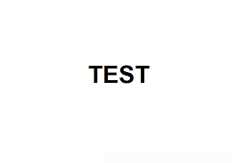

# Anonymizer
ingest any data from a schema and anonymize it or create synthetic data

## Language:
Python v3.12+  https://www.python.org/downloads/

## Environment

<p align="center">
  
</p>


#System Components
## Packages:
Using pip v25.1.1+ <br/>

Pytest v8.4.1 <br/>
[install](https://pypi.org/project/pytest/)
`pip install pytest`

Pydantic v2.11.7 <br/>
[install](https://pypi.org/project/pydantic/)
`pip install pydantic`

Pandas v2.3.1 <br/>
[install](https://pypi.org/project/pandas/)
`pip install pandas`

# Usage
```example():```


purpose
scope
minimal
feature description
