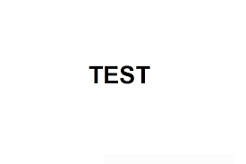

# Anonymizer

## Purpose
ingest any data from a schema and anonymize it or create synthetic data, TODO

## Scope
TODO

## Features
TODO

## Environment and Installation
Python v3.12+ <br/>
uv pip install smoke-mirrors
uv pip install -e . --system


# System Components

## Packages:


# Usage
```example():```

<p align="center">
  
</p>

